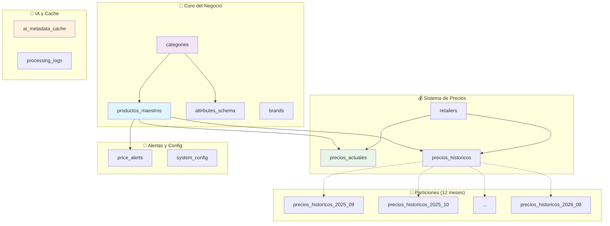
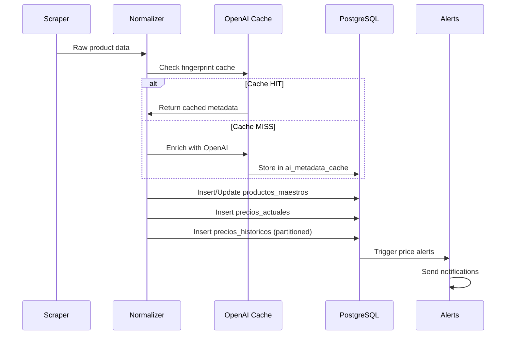
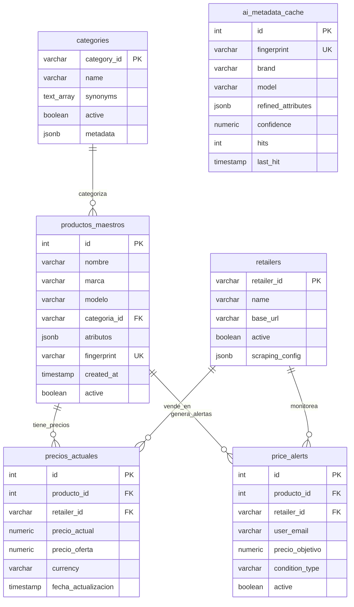

# 🗄️ Base de Datos Completa - Normalizacion IA 2.0

## 📊 Resumen Ejecutivo

**Motor:** PostgreSQL 14+ con extensiones avanzadas  
**Total Tablas:** 25 (incluyendo particiones)  
**Arquitectura:** Microservicios con cache IA  
**Escalabilidad:** Particionamiento automático  

## 🎯 Arquitectura de Alto Nivel



## 🔄 Flujo de Datos Principal



## 📊 Distribución de Datos por Módulo

| Módulo | Tablas | Propósito | Volumen Estimado |
|--------|--------|-----------|------------------|
| **🎯 Core** | 4 | Catálogo maestro | ~100K productos |
| **💰 Precios** | 15 | Sistema comercial | ~50M registros históricos |
| **🤖 IA** | 2 | Cache inteligente | ~50K entradas |
| **🔔 Alertas** | 2 | Notificaciones | ~10K alertas activas |
| **⚙️ Sistema** | 2 | Configuración | ~100 parámetros |

## 🔗 Mapa de Relaciones Detallado



## 🎯 Casos de Uso Principales

### 1. **Pipeline de Normalización** 🔄
```sql
-- Insertar producto normalizado
INSERT INTO productos_maestros (nombre, marca, modelo, categoria_id, atributos, fingerprint)
SELECT 
    enriched_name,
    normalized_brand,
    extracted_model,
    category_from_ai,
    refined_attributes,
    product_fingerprint
FROM normalization_pipeline;
```

### 2. **Consulta de Precios Cross-Retailer** 💰
```sql
-- Comparar precios entre retailers
SELECT 
    pm.nombre,
    pm.marca,
    r.name as retailer,
    pa.precio_actual::float / 100 as precio_clp,
    pa.precio_oferta::float / 100 as oferta_clp
FROM productos_maestros pm
JOIN precios_actuales pa ON pm.id = pa.producto_id
JOIN retailers r ON pa.retailer_id = r.retailer_id
WHERE pm.categoria_id = 'smartphones'
ORDER BY pm.nombre, pa.precio_actual;
```

### 3. **Análisis de Tendencias de Precio** 📈
```sql
-- Evolución de precios por producto (últimos 3 meses)
SELECT 
    pm.nombre,
    DATE_TRUNC('week', ph.fecha_precio) as semana,
    AVG(ph.precio::float / 100) as precio_promedio
FROM productos_maestros pm
JOIN precios_historicos ph ON pm.id = ph.producto_id
WHERE ph.fecha_precio >= CURRENT_DATE - INTERVAL '3 months'
GROUP BY pm.id, pm.nombre, DATE_TRUNC('week', ph.fecha_precio)
ORDER BY pm.nombre, semana;
```

### 4. **Cache IA - Optimización de Costos** 🤖
```sql
-- Verificar cache antes de llamar OpenAI
SELECT 
    fingerprint,
    brand,
    model,
    refined_attributes,
    confidence,
    hits
FROM ai_metadata_cache
WHERE fingerprint = SHA256('product_name_here')
AND last_hit > CURRENT_DATE - INTERVAL '30 days';
```

## ⚡ Optimizaciones de Performance

### **Índices Estratégicos**
```sql
-- Para matching de productos
CREATE INDEX CONCURRENTLY idx_productos_fingerprint_hash 
ON productos_maestros USING hash(fingerprint);

-- Para consultas de precios por fecha
CREATE INDEX CONCURRENTLY idx_precios_fecha_producto 
ON precios_historicos(fecha_precio, producto_id);

-- Para cache IA por frecuencia de uso
CREATE INDEX CONCURRENTLY idx_ai_cache_hits_desc 
ON ai_metadata_cache(hits DESC, last_hit DESC);
```

### **Particionamiento Automático**
```sql
-- Función para crear particiones automáticamente
CREATE OR REPLACE FUNCTION create_monthly_partition(table_name text, start_date date)
RETURNS void AS $$
DECLARE
    partition_name text;
    end_date date;
BEGIN
    partition_name := table_name || '_' || to_char(start_date, 'YYYY_MM');
    end_date := start_date + interval '1 month';
    
    EXECUTE format('CREATE TABLE %I PARTITION OF %I 
                   FOR VALUES FROM (%L) TO (%L)',
                   partition_name, table_name, start_date, end_date);
END;
$$ LANGUAGE plpgsql;
```

### **Mantenimiento Automático**
```sql
-- Cleanup de cache IA (mantener solo últimos 6 meses)
DELETE FROM ai_metadata_cache 
WHERE last_hit < CURRENT_DATE - INTERVAL '6 months'
AND hits < 5;

-- Cleanup de logs antiguos
DELETE FROM processing_logs 
WHERE created_at < CURRENT_DATE - INTERVAL '3 months';
```

## 🔧 Configuraciones Recomendadas

### **PostgreSQL Settings**
```ini
# postgresql.conf optimizaciones
shared_buffers = 256MB
effective_cache_size = 1GB
maintenance_work_mem = 64MB
checkpoint_completion_target = 0.9
wal_buffers = 16MB
default_statistics_target = 100

# Para JSONB
gin_pending_list_limit = 4MB
```

### **Monitoreo y Alertas**
```sql
-- Query para detectar queries lentas
SELECT 
    query,
    calls,
    total_exec_time,
    mean_exec_time,
    stddev_exec_time
FROM pg_stat_statements 
WHERE mean_exec_time > 1000  -- > 1 segundo
ORDER BY mean_exec_time DESC;
```

## 📋 Checklist de Mantenimiento

### **Diario** ✅
- [ ] Verificar espacio en particiones activas
- [ ] Monitorear hits del cache IA
- [ ] Revisar logs de errores en processing_logs

### **Semanal** 📅
- [ ] Crear particiones para próximo mes
- [ ] Analizar queries lentas en pg_stat_statements
- [ ] Backup incremental de tablas core

### **Mensual** 🗓️
- [ ] Cleanup cache IA sin uso
- [ ] Reindex tablas de alta escritura
- [ ] Análisis de crecimiento por partición
- [ ] Review de configuración en system_config

## 🚀 Roadmap de Evolución

### **Q4 2025**
- [ ] Implementar sharding por región
- [ ] Cache distribuido con Redis
- [ ] API GraphQL para consultas complejas

### **Q1 2026**
- [ ] ML models para predicción de precios
- [ ] Time-series database para métricas
- [ ] Auto-scaling basado en carga

---

**📊 Documentación Completa Generada**  
**🗄️ Esquema:** 25 tablas, 200+ campos  
**🔗 Relaciones:** FK constraints + soft references  
**📈 Escalabilidad:** Particionamiento + cache inteligente  
**⚡ Performance:** Índices optimizados + monitoring

**Los archivos incluyen:**
- `DATABASE_SCHEMA.md` - Diagrama ER completo
- `TABLE_DETAILS.md` - Análisis detallado por tabla  
- `db_schema.json` - Esquema raw extraído
- `DATABASE_COMPLETE.md` - Documentación consolidada